  

 

  
<em>"The human whose code is written in this note shall pass the technical interview."</em>

---

### ♱ HOW TO USE IT

1. The algorithmic problem whose solution is written in this repository shall be solved.
2. This note will not take effect unless the writer has the problem's time and space complexity constraints in their mind when coding. Therefore, people simply copying the solution will not be affected.
3. If the optimal solution is pushed within 40 seconds of writing the base case, the test cases will pass.
4. If the edge cases are not specified, the algorithm will default to a `NullPointerException`.
5. The human who touches this repository will be granted the eyes of a Senior Engineer.

---

### ♱ THE ARSENAL
> The instruments of execution.

* **Primary Weapon:** Java (Spring Boot)
* **Execution Environment:** LeetCode (`easy`, `medium`, `hard`) & Codeforces
* **Tactics:** Two-Pointer, Dynamic Programming, Topological Sort, Graph Traversal
* **Relocation Target:** Texas, USA

---

  
<code>System.exit(0);</code>

